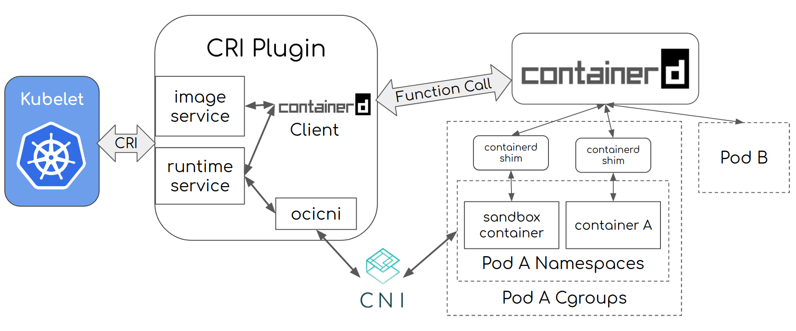

# Architecture of CRI-Containerd
This document describes the architecture of `cri-containerd`.

Cri-containerd is a containerd based implementation of Kubernetes [container runtime interface (CRI)](https://github.com/kubernetes/kubernetes/blob/master/pkg/kubelet/apis/cri/runtime/v1alpha2/api.proto). It operates on the same node as the [Kubelet](https://kubernetes.io/docs/reference/generated/kubelet/) and [containerd](https://github.com/containerd/containerd). Layered between Kubernetes and containerd, cri-containerd handles all CRI service requests from the Kubelet and uses containerd to manage containers and container images.

Cri-containerd uses containerd to manage the full container lifecycle and all container images. As also shown below, cri-containerd manages pod networking via [CNI](https://github.com/containernetworking/cni) (another CNCF project).

Let's use an example to demonstrate how cri-containerd works for the case when Kubelet creates a single-container pod:
* Kubelet calls cri-containerd, via the CRI runtime service API, to create a pod;
* cri-containerd uses containerd to create and start a special [pause container](https://www.ianlewis.org/en/almighty-pause-container) (the sandbox container) and put that container inside the pod’s cgroups and namespace (steps omitted for brevity);
* cri-containerd configures the pod’s network namespace using CNI;
* Kubelet subsequently calls cri-containerd, via the CRI image service API, to pull the application container image;
* cri-containerd further uses containerd to pull the image if the image is not present on the node;
* Kubelet then calls cri-containerd, via the CRI runtime service API, to create and start the application container inside the pod using the pulled container image;
* cri-containerd finally calls containerd to create the application container, put it inside the pod’s cgroups and namespace, then to start the pod’s new application container.
After these steps, a pod and its corresponding application container is created and running.
